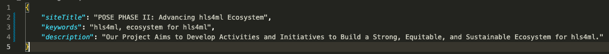
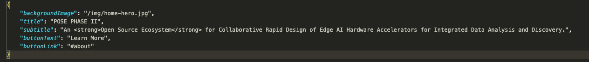

# Pose

This website is built on GitHub Pages using 11ty, a JavaScript-powered static site generator.

## Set Up the Environment

1. **Install Node.js**

   Check if Node.js is installed:

   ```bash
   node -v
   ```

   If not, install Node.js:

   - Windows: Download the installer from the [official website](https://nodejs.org/en/download/).
   - macOS: Install using [Homebrew](https://brew.sh/):
     ```bash
     brew install node
     ```
   - Linux (Ubuntu/Debian):
     ```bash
     sudo apt-get update
     sudo apt-get install nodejs
     sudo apt-get install npm
     ```

2. **Clone the Repository**

   Clone this repository to your local machine:

   ```bash
   git clone https://github.com/guanyixi/pose.git
   ```

3. **Install Dependencies**

   Change directory (cd) into the site repository and install the required Node modules:

   ```bash
   cd pose
   npm install
   ```

## Development and Deployment

1. **Development Scripts**

   - Start the development server:

     ```bash
     npm start
     ```

   - Build the site for production:

     ```bash
     npm run build
     ```

2. **Deployment**

   - When you push changes to GitHub, the workflow will copy the files from the `/public/` folder to the `gh-pages` branch.
   - In the repository's Settings > Pages, the source should be set to "Deploy from a branch", and the Branch should be `gh-pages`, with the folder set to `/(root)`.
   - In the root directory, change the `pathPrefix` in `.eleventy.js` to match your GitHub repository name.

## Edit Content

1. **Global Content**

**File Path: `/src/_data/global.json`**

This file currently controls the metadata in the `<head>` section of your HTML. For optimal display in search results, please adhere to the following guidelines:

- The title should be fewer than 60 characters.
- The description should be fewer than 160 characters.



2. **Static Content**

Static content includes the following sections

- Hero: `/src/_data/hero.json`
- About: `/src/_data/about.json`
- Training Material: `/src/_data/training.json`
- Success Stories: `/src/_data/stories.json`

The content can be easily edited in the json files.


3. **Collections**

In Eleventy (11ty), a collection is a set of content, typically markdown files, that can be processed and manipulated together. Collections are used for managing teams and events to enhance scalability. This setup allows for the potential creation of individual pages for each team member or event in the future.

#### Team

**File Path: `/src/team/`**

- Each team member's data is stored in a markdown file.
- On the home page, team members are displayed in the order of their file names ASC.
- The excerpt, which is displayed before users click the "Show More" button, should ideally be the first 1-2 sentences of the bio. This prevents content from shifting when the button is clicked.

**Adding a New Team Member**

1. Create a new markdown file in `/src/team/`. Name the file in the format: `{order}-{firstname}-{lastname}.md`.
2. Add the avatar image to `/src/img/team/`. Name the image file: `{firstname}-{lastname}.jpg`. The image should be 250px by 250px and in JPG format.
3. Copy the content from an existing team member's markdown file to the new one, then update the content as needed.

#### Events

**File Path: `/src/events/`**

- Similar to the team data, each event's data is stored in a Markdown file.
- On the home page, events are displayed in ascending order based on their filenames, and only upcoming events are automatically displayed.
- If there are fewer than four events, the event cards will be displayed as static cards instead of a slider.
